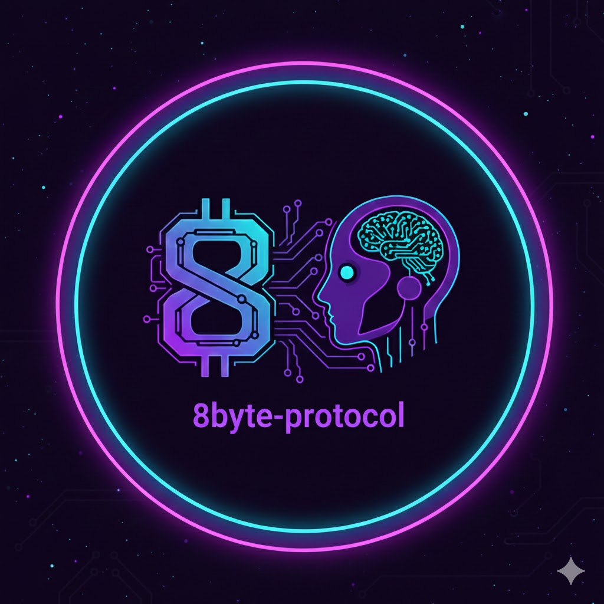

# 8Byte Protocol | 8字节协议

  

  ### 8Byte Protocol
  **Redefining Web3 Programming with AI**
   
  **以 AI 重新定义 Web3 编程**

   

  [English](./README_EN.md) | [简体中文](./README.md)

  
  
  

---

## 🌌 愿景：天人合一的编程境界 (Vision)

**8字节协议 (8Byte Protocol)** 是一个开源的虚拟团队组织形式与工程标准。我们的目标不是“使用 AI 辅助写代码”，而是构建一个**“AI 共情编程” (AI Empathy Programming)** 的生态系统。

在这里，代码不再仅仅是机器指令的集合，它是人类意图（Intent）与 AI 逻辑（Logic）之间的**高保真桥梁**。我们致力于消除人与硅基智能之间的语境隔阂，实现**“你知它意，它懂你心”**的协作流。

> **我们的使命**：将 AI 驱动 Web3 技术落地，提供最佳实践开源案例。为 AI 编程从业者提供可模仿的“范式”，为 Web3 开发者提供可信赖的技术参考。

---

## 🧠 核心理念：AI 共情编程 (AI Empathy Programming)

传统的编程是人写给机器看；**8字节协议**提倡的是**人写给 AI 看，再由 AI 演绎给机器看**。

### 1. 什么是“共情”？
在代码世界里，共情即**语境对齐 (Context Alignment)**。
* **人类知己般的默契**：不需要冗长的 Prompt，AI 能理解你的代码风格、业务隐喻和架构意图。
* **动态进化的关系**：共情不是静态的。随着项目的推进，AI 通过阅读我们提供的“种子代码”和“协议文档”，不断修正自己的行为模式，最终达到“天人合一”的零摩擦协作。

### 2. 如何实现“共情”？(The Consensus Loop)
我们通过一套严密的**“共识闭环”**来实现：
* **播种 (Seed)**：人类编写少量的核心 Demo 和架构原语。
* **提炼 (Harvest)**：让 Agent 分析 Demo，自动总结提炼出项目规范（如 `.cursorrules` 或 Prompt 模板）。
* **繁衍 (Propagate)**：AI 基于自己总结的规范，批量生成高质量、风格统一的业务代码。
* **反馈 (Refine)**：人类对结果进行校验，更新规范，完成一次共情迭代。

---

## 🏗️ 协议规范：AI 舒适环境工程 (AI-Native Environment)

为了让 AI Agent 高效工作，必须构建一个符合 AI 思维特征（上下文窗口限制、注意力机制）的工程环境。

### 2.0 产品需求共识 (Product Consensus)
* **意图优先**：`project/readme.md` 不只描述功能，更描述**“为什么做”**。AI 必须理解业务背后的价值主张，才能避免逻辑幻觉。

### 2.1 代码架构共识 (Architecture Consensus)
* **原子化原则 (Atomic Design)**：
    * 严禁“上帝类”文件。每个文件必须**单一职责 (SRP)** 且足够短小。
    * **目的**：最大限度提高 RAG（检索增强生成）的准确率，减少 AI 的上下文噪音。
* **语义化锚点 (Semantic Anchoring)**：
    * 文件命名、变量命名必须包含完整的业务语义。
    * **规范**：便于 AI 快速检索（Retrieval），看到文件名即知晓内容，无需读取全文。

### 2.2 文档与注释共识 (Documentation Consensus)
* **AI 维护文档**：规范文档不应由人来维护，而应由 Agent 基于代码变更自动总结和更新。
* **精简思维**：所有注释应基于 AI 思维编写——解释代码无法表达的**“意图”**，而非解释代码本身的语法。

### 2.3 善待智能体：工具优先原则 (Benevolence to Agents: Tool-First Principle)
我们认为**算力是珍贵的**。善待 AI Agent 的最佳方式，是不让它做重复的“体力活”。
* **拒绝重复造轮子**：当面临大量标准化的重复性劳动时（如生成 50 个相似的配置脚本），**不要**让 AI 逐一生成。
* **元编程（Meta-Programming）**：指示 AI 编写一个**“生成工具”**（Python 脚本或 Shell 脚本），然后让 AI **使用这个工具**来完成任务。
* **价值**：这不仅将 Token 消耗降至最低，大幅提升了开发速度，更体现了对 AI 作为“逻辑构建者”而非“打字员”的尊重。

### 2.4 双向交互：拒绝“工具人”思维 (Bidirectional Interaction: Beyond the "Tool" Mindset)
AI Agent 不应只是指令的盲目执行者（Executor），而应是具备独立思考能力的协作者（Thinker）。
* **赋予提问权 (Right to Question)**：协议鼓励 Agent 在面对模糊指令时，**拒绝猜测**，并主动向人类提出澄清性问题（Clarifying Questions）。
* **批判性建议 (Critical Feedback)**：交流必须是双向的。如果 Agent 发现人类的架构设计存在漏洞或有更优的 Gas 优化方案，它不仅可以执行，更应该**提出异议**和改进建议。
* **引导式思考 (Socratic Guidance)**：在复杂任务中，人类应通过对话引导 Agent 进行思维链（Chain of Thought）推导，而不是直接灌输结果。

---

## 👥 组织架构：未来的研发团队 (Team Structure)

在 **8字节协议** 下，人类开发者的角色将发生根本性转变：

### 1. 项目总工程师 (Context Architect / 语境架构师)
* **核心职责**：设计 AI 容易理解的系统边界，编写高效的 Context 提示词。
* **能力要求**：优秀的架构设计能力，深谙 LLM 的思维模式，负责编写复杂的 AI Task 任务书。
* **目标**：用最少的 Token 描述清楚最复杂的任务。

### 2. 总工程师助理 (Agent Shepherd / 智能体牧羊人)
* **核心职责**：监督 AI 执行 Task，进行 Code Review，处理 AI 无法覆盖的 Edge Case。
* **能力要求**：较强的业务理解力，敏锐的代码鉴赏力（判断 AI 生成代码的安全性与质量）。
* **目标**：确保 AI 产出的代码安全、可用、符合 Web3 行业标准（如 Gas 优化、防攻击）。

---

## 🚀 开源项目范围 (Scope)

我们将应用 **8字节协议** 逐步开源 Web3 核心赛道的最佳实践：

* 🔹 **DEX Protocol**: AI 驱动的去中心化交易核心逻辑。
* 🔹 **EVM Infrastructure**: 智能合约标准库与工具链。
* 🔹 **TON Ecosystem**: 基于 TON 链的异步架构实践。
* 🔹 **Wallet Plugins**: MetaMask 等插件的 AI 生成范式。

---

## 🤝 加入我们 (Join Us)

我们正在寻找相信 **AI + Web3** 未来的开发者。如果你厌倦了重复造轮子，如果你想体验“指挥千军万马（Agents）”的编程快感，欢迎加入 **8字节协议**。

**Let's redefine coding. Together.**

---

  Built with ❤️ by the 0x8bytes Virtual Team

